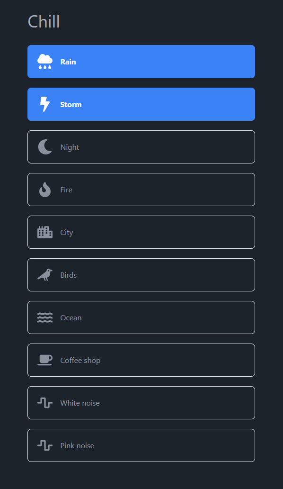

# Chill

This app allows you inspire focusing by listening relaxing sounds

Inspired by [blanket](https://github.com/rafaelmardojai/blanket)

  

## Features

- State management with `jotai`
- Around 16kb after brotli compression
- `preact` under the hood with `preact/compat` makes it compatible with virtually any `react` library but still makes it faster
- Full TypeScript support — no dangling types
- `vite` packager and devtools make building and development lightning fast
- `tailwind-css` built-in with 'daisyui'
- GitHub Actions that lint and check the code on pull requests
- `prettier` and `eslint` configured, enabled and formatting your code on save
- List of recommended extensions for VSCode
- It is important to keep the bundle small, so a `stats.html` file is generated on `yarn build` to visually show you the bundle size

## Local launch

1. Install vite with `yarn add vite`
2. Install dependencies with `yarn`
3. Run the server with `yarn start`
